# Neural-Stylr

Neural-style transfer [(NST)](https://arxiv.org/pdf/1508.06576v2.pdf) algorithm implementation using Tensorflow.

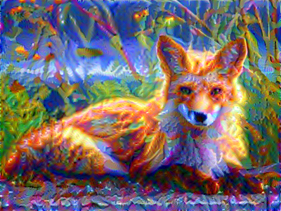

## Using Neural-Stylr

Neural-stylr can be run with this project, or by running a demo Docker image.

### Setup

#### With Cloned Project

Clone the project

```bash
git clone https://github.com/IMBurbank/neural-stylr.git
cd neural-stylr
```

Download pretrained model

```bash
./model/scripts/download_vgg19.sh
```

Download any desired images to `model/images/input/`. There is a starter-pack of images already in the `input` folder that can be used for exploration.

The `vgg19` model takes input images sized `300x400`. Input images of any other size will be automatically resized and center-cropped to the default aspect-ratio. Output images will be `300x400`.

Next, build a Docker image with the necessary dependencies.

```bash
# Image is built for gpu-support by default
./model/scripts/docker_build_dev.sh

# Add flag -c for to use CPU instead
./model/scripts/docker_build_dev.sh -c
```

Run Docker image.

```bash
# Image is built for gpu-support by default
./model/scripts/docker_run_dev.sh

# Add flag -c for to use CPU instead
./model/scripts/docker_run_dev.sh -c
```

Change to `model` directory.

```bash
cd model
```

#### With Demo Docker Image

Run demo image hosted on Docker Hub

```bash
# GPU demo image
docker run --rm --runtime nvidia -u $(id -u):$(id -g) -it dget/dock-stylr:gpu-demo

# CPU demo image
docker run --rm -u $(id -u):$(id -g) -it dget/dock-stylr:demo
```

### Usage

Once set up, run `stylr.py` and enjoy.

```bash
# Run stylr algorith using default images and settings
python stylr.py

# See parameter options
python stylr.py -h

# Make a beautiful kandinsky-hummingbird-sphinx-moth
python stylr.py \
    -c images/input/hummingbird-sphinx-moth-small.jpg \
    -g images/input/wassily-kandinsky-romantic-landscape-1911-small.jpg \
    -s 0.25 -r 2.5 -a 30 -w 0.1 0.1 0.1 0.1 0.1
```

## Examples

Here are a few of my favorite creations. More can be found in `assets/examples` - along with the configurations used to create them. 

Style               | Content                | NST
:------------------:|:----------------------:|:----------------------:
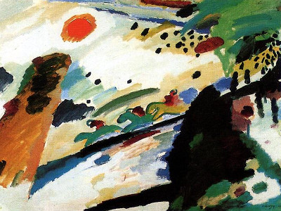 | 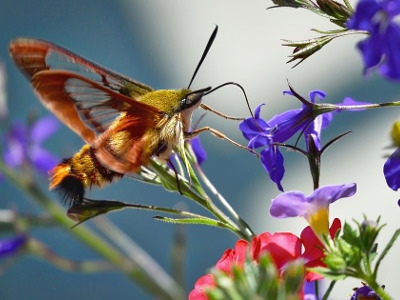 | 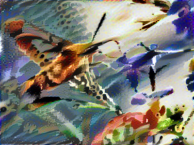
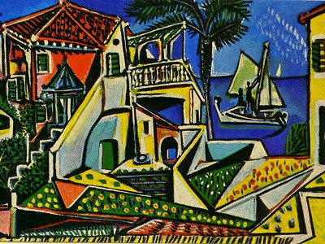 | 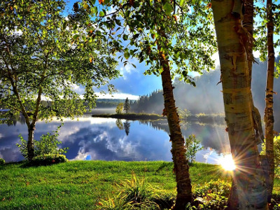 | 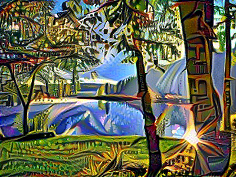
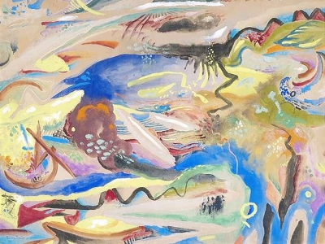 | 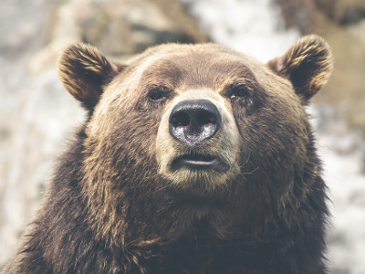 | 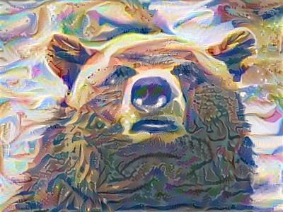
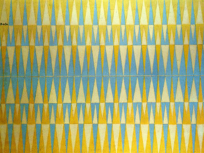 |  | 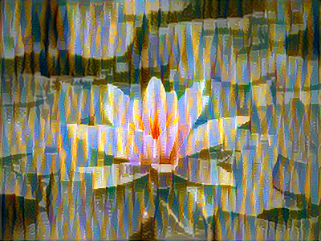
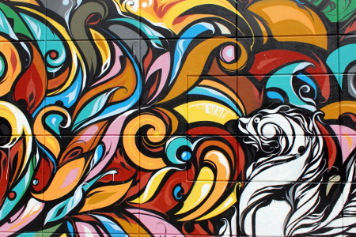 | 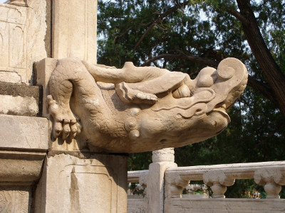 | 
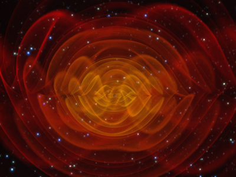 | 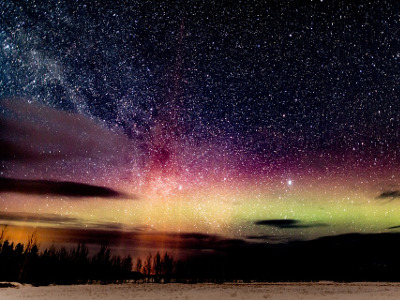 | 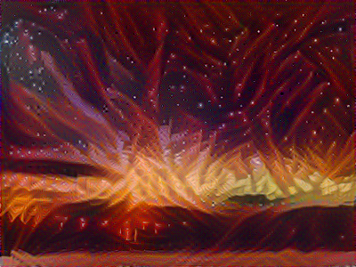
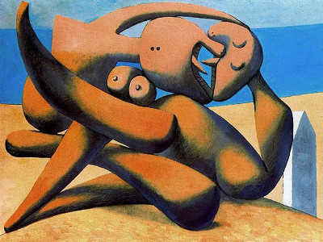 | 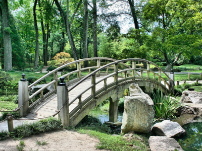 | 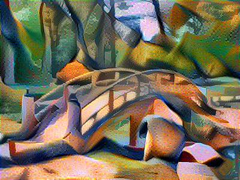
 | 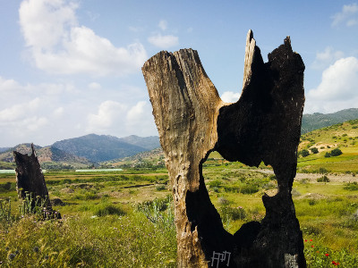 | 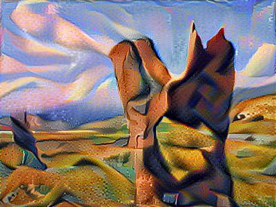
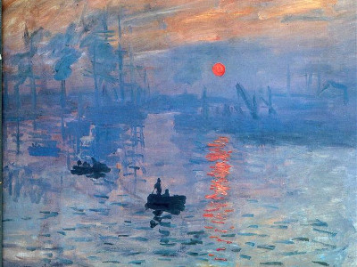 | 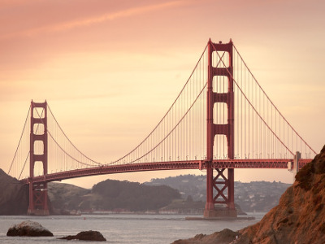 | 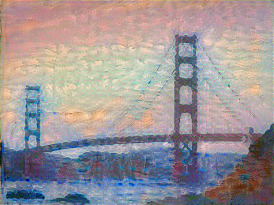
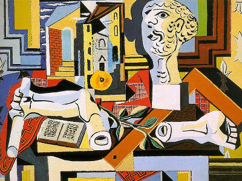 |  | 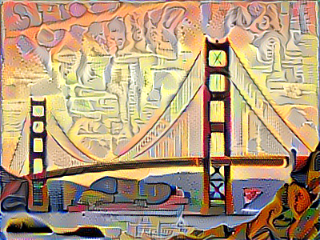